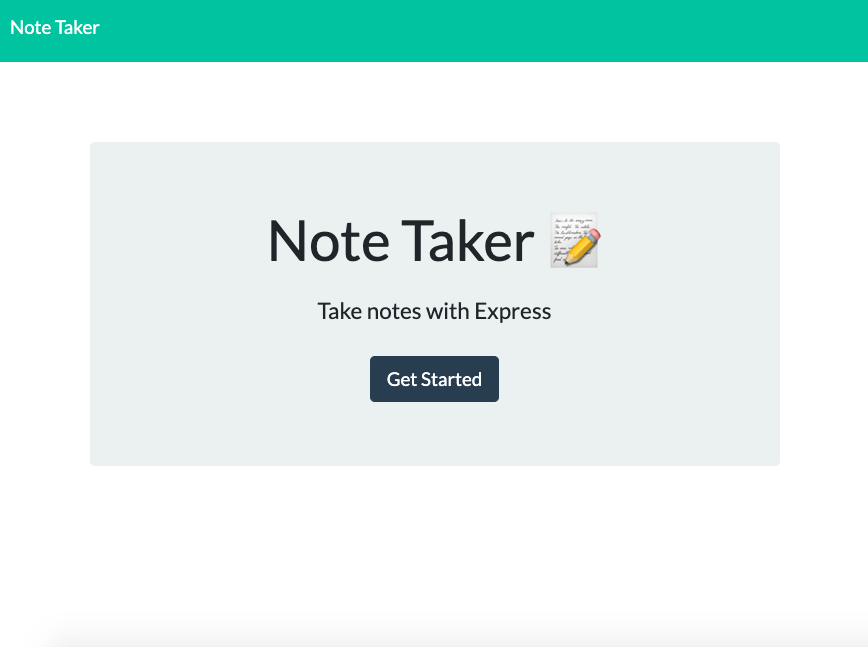

# [Note-Taker]()
[](Develop/License/MIT.md)
[](#technologies)


## Description 


## Table of Contents

* [Technologies](#technologies)
* [Demonstration](#demonstration)
* [Application](#Application)
* [Installation](#installation)
<!-- * [Test](#test) -->
* [Acknowledgements](#acknowledgements)
* [Questions](#questions)
* [Course Submission ](#course Submission )

## Technologies

* JavaScript
* Bootstrap
* Node.js
* Express
* npm
* HTML
* CSS

## Application 



## Demonstration 

<!-- [Application Link](https://drive.google.com/file/d/1X1uUVhLb7KOW-qnKDFIz9N1mOHsrWt2Y/view) -->


## Installation

The following installations are needed for this package:
1. npm init (creates a package.json)
2. npm install (installs a package-lock.json)
3. npm install node (creates node_modules)

    
Once in the correct directory (where server.js is located), run "node server.js"


<!-- ## Test

* To run test, run the following command 

```npm run test``` -->


## Acknowledgements


* [Common templates for user stories](https://en.wikipedia.org/wiki/User_story#Common_templates)
* UW Coding Bootcamp instructional team and classmates
    * test files already provided
    * skeleton of html files already provided
    * htmlRenderer.js already provided
* [Bootstrap](https://getbootstrap.com/docs/4.1/getting-started/introduction/)


## Questions 

If you have any questions, please contact me on:
GitHub at [avaarm](https://github.com/avaarm) &
Email at [Armenuhi](mailto:avaarm95@mail.com)


